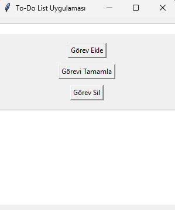

Tabii, aşağıda bu proje için GitHub açıklaması (README.md) oluşturuyorum:

```markdown
# To-Do List Uygulaması

Bu proje, Python ve Tkinter kullanarak oluşturulmuş basit bir To-Do List uygulamasıdır. Kullanıcıların görev eklemesine, görevleri tamamlanmış olarak işaretlemesine ve görevleri silmesine olanak tanır.

## Özellikler

- Görev ekleme: Kullanıcı yeni bir görev ekleyebilir.
- Görev tamamlama: Kullanıcı mevcut bir görevi tamamlanmış olarak işaretleyebilir.
- Görev silme: Kullanıcı mevcut bir görevi silebilir.
- Görev listeleme: Tüm görevler ve durumları (Tamamlandı/Tamamlanmadı) liste olarak görüntülenir.

## Kurulum

1. Bu projeyi klonlayın:

   ```bash
   git clone https://github.com/kullanici-adi/todo-list-uygulamasi.git
   cd todo-list-uygulamasi
   ```

2. Gerekli Python sürümünün yüklü olduğundan emin olun (Python 3 önerilir).

## Kullanım

1. Ana dizinde bulunan `todo_list.py` dosyasını çalıştırın:

   ```bash
   python todo_list.py
   ```

2. Program başlatıldığında, kullanıcı görev ekleyebilir, tamamlayabilir veya silebilir.

## Kod Açıklaması

- `add_task()`: Yeni bir görev ekler ve görev listesini günceller.
- `update_task_list()`: Görev listesini günceller ve mevcut görevleri listeler.
- `complete_task()`: Belirtilen görevi tamamlanmış olarak işaretler.
- `delete_task()`: Belirtilen görevi listeden siler.

## Ekran Görüntüleri



## Katkıda Bulunma

Katkıda bulunmak isterseniz, lütfen bir fork yapın, ardından bir pull request gönderin. Her türlü katkı ve geri bildirim memnuniyetle karşılanır!

1. Projeyi fork edin
2. Bir özellik dalı oluşturun (`git checkout -b yeni-ozellik`)
3. Değişikliklerinizi commit edin (`git commit -am 'Yeni özelliği ekle'`)
4. Dalınıza push edin (`git push origin yeni-ozellik`)
5. Bir pull request açın

## Lisans

Bu proje MIT Lisansı ile lisanslanmıştır. Daha fazla bilgi için `LICENSE` dosyasına bakabilirsiniz.

## İletişim

Herhangi bir sorunuz veya geri bildiriminiz varsa, lütfen benimle iletişime geçin:

- Email: [email@example.com](info@tarikaykan.com)
- GitHub: [kullanici-adi]([https://github.com/kullanici-adi](https://github.com/TarikAykan))

```

Bu açıklama, projenizin kurulumunu, kullanımını ve katkıda bulunma süreçlerini açık bir şekilde anlatır. Ayrıca, projeyi görselleştirmek için ekran görüntüleri de ekleyebilirsiniz. Bu ekran görüntülerini `screenshots` adlı bir klasöre kaydedip, ilgili bağlantıları README dosyasına ekleyebilirsiniz.
